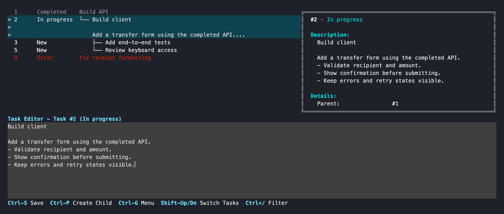

# qqq

**Give your coding agents a shared queue.**

You write the tasks. Agents claim the next ready one, report progress, and mark it
done. qqq keeps the queue in your project, with a terminal dashboard for the work
you want to inspect or change yourself.



[Get started](#try-it) · [Agent setup](#give-your-agent-the-queue) · [Docs](docs/reference.md)

## Why a queue?

- **Multiple agents, clear ownership.** Workers sharing the same local
  project claim separate tasks.
- **Dependencies that mean something.** “Build the client” waits until “Build the
  API” is complete. Priorities choose which ready task comes next.
- **Context that survives a session.** Descriptions, updates, screenshots, and
  history stay with the task when you return, retry, or hand off work.

SQLite stores tasks in `.qqq/qqq.db`; images live in `.qqq/images/`. No server or
account needed. Your agent runs the code and checks; qqq tracks the work.

## Install

```sh
cargo install qqq-cli --locked
```

Requires Rust 1.85+ and a C compiler. The command is `qqq`.
[Install from source](docs/reference.md#install-from-source) for development features.

## Try it

Start in an empty directory so the example task IDs match:

```sh
mkdir qqq-demo
cd qqq-demo
qqq init

qqq add "Build API"
qqq add "Build client" --parent 1
qqq list
```

```text
ID     STATUS        PRI TASK
1      New             0 Build API
2      New             0 └── Build client
```

Claim the API task. Once your work is done, record an update and complete it:

```sh
qqq next --local --session agent-1
# Do the work, then:
qqq message 1 "API ready" --session agent-1
qqq complete 1 --session agent-1
qqq next --local --session agent-1
```

The last command claims **Build client**. Completing its parent made it ready.
Repeated `next` calls return your active task until you complete or release it.

For your own project, run `qqq init` at its root and use the IDs returned by `add`.
Commands also work from subdirectories. Add `.qqq/` to your `.gitignore`.

Recognized agent callers get JSON by default: native Codex sessions
(`CODEX_THREAD_ID` or `CODEX_SESSION_ID`) and exact Herdr panes reporting an
agent. Use global `--human` for readable text, or `--json` to request JSON
explicitly. Ordinary shells keep readable output, including when piped.
Help and version output stay text.

## See and edit the work

Pipe multiline descriptions with `qqq add --stdin`, or load a complete plan with
`qqq import plan.json --dry-run` followed by `qqq import plan.json`.
Independent prerequisites can gate integration work while keeping its tree parent:
`qqq add "Integrate API and UI" --parent 1 --depends-on 2 --depends-on 3`.
Manage extras with edit's `--depends-on`, `--remove-depends-on`, and
`--clear-depends-on`; all prerequisites must complete before a new claim.

Add tags with `qqq add "Fix layout" --tag frontend --tag bug`; lists show
`[frontend] [bug] Fix layout`. Replace via `qqq edit 1 --set-tags "frontend, bug"`,
clear via `--set-tags ""`, or edit selected task tags with Ctrl-L in TUI.
On a new draft, Ctrl-L stages tags before Ctrl-S creates the task. Workers see
the description and tags together when the task enters the queue.
In the tag editor, Enter adds a line, Ctrl-S applies tags, Ctrl-U deletes the
current line, and Esc/Ctrl-C cancels.

See [batch schema and piping examples](docs/reference.md#atomic-batch-import).

Inspect readiness, owners and blockers with `qqq status`. Preview selection reasons
with `qqq next --explain`; neither command claims work. Both support `--json`.
See [queue diagnostics](docs/reference.md#queue-diagnostics) for filters and owner context.

```sh
qqq tui
```

Browse the tree, read task details, and edit descriptions in one window. Click a
task to load it, scroll each pane, or use the keyboard:

| Key | Action |
| --- | --- |
| Shift+Up / Shift+Down | Move between tasks and a blank draft |
| Ctrl+S | Save |
| Ctrl+L | Edit task or new draft tags; retain unsaved drafts |
| Ctrl+K | Go to task ID; retain unsaved drafts |
| Ctrl+P | Create a child of the selected task |
| Ctrl+/ | Filter tasks |
| Ctrl+G | Open task actions |
| Ctrl+H | Open linked Herdr agent; shown only for tasks with a Herdr link |
| Esc | Close the filter, clear the editor, then exit; changed drafts ask before discard |

Ctrl+G menu includes `e Mark error`. Enter reason, confirm with `y`; marking
error requires ownership of an in-progress task.
Menu groups status actions, settings (`Priority`, `Set parent`), and
archive visibility, with an empty line between groups. Arrows skip empty rows;
short terminals keep selected action visible while scrolling menu.

Task details and `qqq show` display assignment in two aligned rows:
`Harness session (name)` and `Orchestrator session (name)`.

`qqq add` opens the built-in editor too. Prefer Vim or another editor? Set
`EDITOR` and use `qqq add --edit`.

## Give your agent the queue

Give each worker a unique, stable session ID, replacing `agent-1` for each worker.
To keep working as new tasks arrive, start with this `/goal` prompt:

```text
/goal Use `qqq next --wait` to pick up the next task and work on it. Complete
each task after its checks pass, then get the next one. Loop indefinitely.
Keep the blocking wait running; don't wake up repeatedly to poll status.
```

`--wait` blocks until work is ready. `--json` returns full task data for the agent.
A restarted worker using the same session gets its current task back; claims do
not expire. [Return or retry work](docs/reference.md#return-or-retry-work) when a
worker gets stuck.

Native Codex session discovery can supply identity automatically. Optional
[Herdr integration](docs/reference.md#herdr) links live agents or opens new agent
tabs. Explicit sessions and `--local` work independently.

## Keep going

- [Commands, filters, and JSON](docs/reference.md#list-and-show)
- [Ownership, failures, and recovery](docs/reference.md#agents-and-recovery)
- [Images and dependencies](docs/reference.md#dependencies-and-images)
- [Backups and project health](docs/reference.md#data)
- [Config and aliases](docs/reference.md#config-and-aliases)
- [Build, test, and contribute](docs/reference.md#development)

[MIT license](LICENSE).
